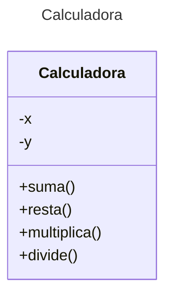

# Proyecto - Java Calculadora con Pruebas para Autograding - Maven

## Descripción del Problema

Este ejercicio implementa una calculadora aritmética simple (suma, resta, multiplica, divide).

## Ejecución

Tu programa debería ejecutarse de la siguiente manera:

```
Calculadora aritmetica
======================
Introduce el primer operando:12
Introduce el segundo operando:4
12+4=16
12-4=8
12*4=48
12/4=3
```


# Diagrama de clases
[Editor en línea](https://mermaid.live/)

[Referencia-Mermaid](https://mermaid.js.org/syntax/classDiagram.html)

## Diagrama de clases UML con draw.io
El repositorio está configurado para crear Diagramas de clases UML con ```draw.io```. Para usarlo simplemente agrega un archivo con extensión ```.drawio.png```, das doble clic sobre el mismo y se activará el editor ```draw.io``` incrustado en ```VSCode``` para edición. Asegúrate de agregar las formas UML en el menú de formas del lado izquierdo (opción ```+Más formas```).

## Uso del proyecto con Maven

### Compilar
```
mvn -f app compile
```
### Probar N tests
```
mvn -f app test
```
### Probar 1 test
```
mvn -f app test -Dtest="AppTest#testSuma"
mvn -f app test -Dtest="AppTest#testResta"
mvn -f app test -Dtest="AppTest#testMultiplica"
mvn -f app test -Dtest="AppTest#testDivide"
``` 
### Ejecutar App
```
java -cp app/target/classes miPrincipal.App
```
### Empacar App
```
mvn -f app package
```
### Limpiar binarios
```
mvn -f app clean
```
## Comandos Git-Cambios y envío a Autograding

### Por cada cambio importante que haga, actualice su historia usando los comandos:
```
git add .
git commit -m "Descripción del cambio"
```
### Envíe sus actualizaciones a GitHub para Autograding con el comando:
```
git push origin main
```
